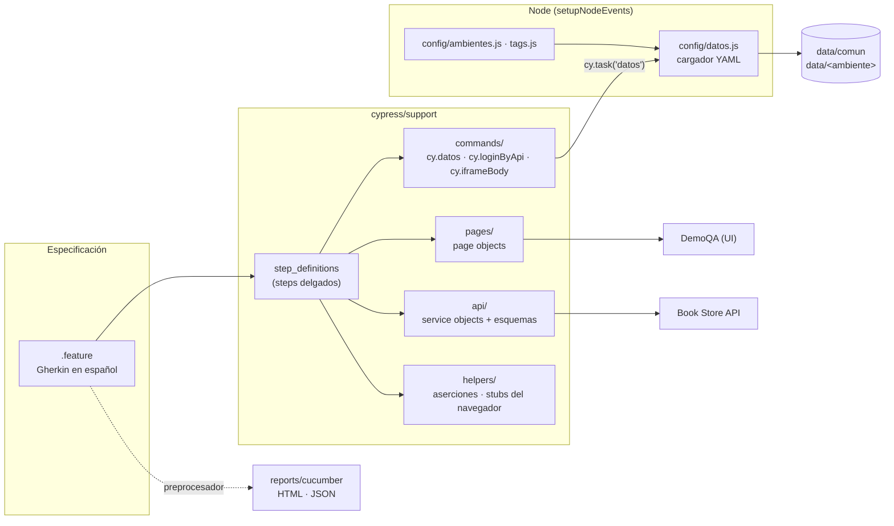

# Cypress + Cucumber: automatización E2E y de API sobre DemoQA

[](https://github.com/DannyDan2016/cypress-automation-demoqa/actions/workflows/e2e.yml)
[](https://dannydan2016.github.io/cypress-automation-demoqa/)
[](LICENSE)


Suite de pruebas de [DemoQA](https://demoqa.com) con **BDD ejecutable en español**, **Page Object Model estricto**, **datos y valores esperados en YAML por ambiente**, pruebas de **API con validación de contratos** y ejecución **reproducible en Docker y en GitHub Actions**.

Es una **muestra curada**: los escenarios se eligieron por la técnica que demuestran y el riesgo que cubren, no por volumen. El criterio, el inventario completo (192 casos) y la trazabilidad están en [docs/estrategia-de-pruebas.md](docs/estrategia-de-pruebas.md).

## Qué demuestra

| Necesidad                       | Cómo se resuelve                                                                                                                               |
| ------------------------------- | ---------------------------------------------------------------------------------------------------------------------------------------------- |
| Escenarios legibles por negocio | Gherkin en español (`# language: es`) con [@badeball/cypress-cucumber-preprocessor](https://github.com/badeball/cypress-cucumber-preprocessor) |
| Mantenibilidad                  | Page objects con solo locators y acciones; los steps no tienen selectores, URLs ni datos de negocio                                            |
| Datos por ambiente              | `data/comun` + `data/<ambiente>` (YAML, merge profundo) leídos con `cy.datos()`                                                                |
| Formularios complejos           | react-select, datepicker y subida de archivos con `selectFile`                                                                                 |
| Diálogos y ventanas nuevas      | Stubs de `window.alert/confirm/prompt/open`                                                                                                    |
| Temporizadores                  | `cy.clock()` / `cy.tick()`: ninguna espera fija                                                                                                |
| API                             | Service objects con `cy.request` y contratos JSON Schema validados con ajv                                                                     |
| Sesión sin pasar por la UI      | Login por API e inyección de cookies con `cy.session`                                                                                          |
| Datos aislados                  | Usuarios únicos creados y borrados por API en cada escenario                                                                                   |
| Defectos reales                 | Escenarios `@known-bug` que comprueban el comportamiento correcto, excluidos por defecto                                                       |
| Reproducibilidad                | Imagen `cypress/included` con docker compose, la misma en local y en CI                                                                        |

## Stack

- Cypress 16.1.1 (Chrome) sobre Node 24
- Cucumber: `@badeball/cypress-cucumber-preprocessor` 28 + `@bahmutov/cypress-esbuild-preprocessor` + esbuild
- `js-yaml` (datos de prueba), `ajv` (contratos de API), `dotenv` (configuración local)
- ESLint 10 + `eslint-plugin-cypress`, Prettier
- Docker (`cypress/included:16.1.1`) y GitHub Actions (artefactos y GitHub Pages)

## Arquitectura



Flujo de un step: el `.feature` solo nombra **claves** (`el caso "valido"`); el step pide `cy.datos('elements/text-box', 'casos.valido.entrada')`, Node fusiona `data/comun` con el ambiente activo y el step se lo pasa al page object. Si la clave no existe, el error indica el archivo, el ambiente, el tramo de la clave que falla y las claves disponibles.

## Estructura

```text
.
├── .github/                       # workflow E2E, dependabot y plantilla de PR
├── config/                        # código Node: ambientes, tags y cargador YAML (+ pruebas node:test)
├── cypress/
│   ├── e2e/features/              # .feature por área (elements, forms, alerts-frames-windows,
│   │                              #   bookstore-api, bookstore-ui)
│   ├── fixtures/archivos/         # solo binarios de subida
│   └── support/
│       ├── api/                   # AccountApi, BookStoreApi, schemas/*.json, contract.js, testUsers.js
│       ├── commands/              # cy.datos, cy.iframeBody, cy.loginByApi
│       ├── helpers/               # aserciones web-first y stubs del navegador
│       ├── pages/                 # BasePage + page objects por área + registro (index.js)
│       ├── step_definitions/      # steps por área + comunes
│       └── e2e.js
├── data/
│   ├── comun/                     # entradas y esperados compartidos
│   ├── qa/  staging/              # overrides por ambiente (solo lo que cambia)
├── docs/estrategia-de-pruebas.md  # alcance, inventario, trazabilidad y bugs
├── scripts/validar-tags.js        # "strict markers" para los tags de las features
├── .cypress-cucumber-preprocessorrc.json
├── cypress.config.js
├── Dockerfile  docker-compose.yml
└── .env.example
```

## Cómo ejecutar

### Requisitos

- Node 24 (ver `.nvmrc`) y Google Chrome, o solo Docker.

### Local

```bash
npm ci
npm run lint              # ESLint + validación de tags de las features
npm run test:unit         # pruebas unitarias del cargador YAML, ambientes y tags
npm test                  # toda la suite salvo @known-bug (Chrome, headless)
npm run test:smoke        # solo @smoke
npm run cy:open           # modo interactivo
```

### Docker

```bash
npm run test:docker        # toda la suite salvo @known-bug
npm run test:docker:smoke  # solo @smoke
```

El reporte queda en `./reports/cucumber/` del host (volumen montado).

### CI (GitHub Actions)

El workflow [`e2e.yml`](.github/workflows/e2e.yml) construye la imagen del repo y ejecuta todo dentro de ella:

| Evento                     | Qué ejecuta                                              |
| -------------------------- | -------------------------------------------------------- |
| Pull request y push a main | lint + unitarias + `@smoke and not @known-bug`           |
| Nocturno (05:00 UTC)       | lint + unitarias + `not @known-bug` (regresión completa) |
| Manual (Run workflow)      | expresión de tags y ambiente a elección                  |

Cada ejecución sube `reports/` como artefacto; desde `main`, el reporte HTML se publica en [GitHub Pages](https://dannydan2016.github.io/cypress-automation-demoqa/).

## Multiambiente

El ambiente sale de `--expose TEST_ENV=<ambiente>`, de la variable `TEST_ENV` (o `.env`) o, por defecto, `prod`. Ambientes: `dev`, `qa`, `staging` y `prod` (DemoQA solo tiene uno público, así que todos apuntan a la misma URL; `BASE_URL` permite sobrescribirla).

```bash
npm run test:qa
npm run test:staging
npx cypress run --browser chrome --expose "TEST_ENV=qa,tags=@smoke and not @known-bug"
```

Los datos se resuelven como `data/comun/<archivo>.yaml` + `data/<ambiente>/<archivo>.yaml`: el override solo declara lo que cambia (ejemplos en `data/qa/elements/text-box.yaml` y `data/staging/elements/web-tables.yaml`).

Para trabajar con `.env`, copia `.env.example`; ningún escenario necesita credenciales.

## Tags

| Tag              | Significado                                                                       |
| ---------------- | --------------------------------------------------------------------------------- |
| `@smoke`         | Camino crítico; se ejecuta en cada PR                                             |
| `@regression`    | Regresión completa (todas las features)                                           |
| `@negative`      | Caso negativo o de error                                                          |
| `@known-bug`     | Defecto real del sitio: comprueba lo correcto, falla hoy y se excluye por defecto |
| `@tc-<area>-NNN` | ID del caso en el inventario (trazabilidad)                                       |

`npm run lint` rechaza tags no declarados y escenarios sin `@smoke`/`@regression` o sin ID de caso. Filtrado:

```bash
npm run test:regression
npm run test:known-bugs                                    # falla mientras el defecto exista
npx cypress run --browser chrome --expose "tags=@tc-api-005"
```

## Reporte

Reporte HTML de Cucumber (escenarios en español, pasos, errores y capturas de los fallos) en `reports/cucumber/index.html`, más `cucumber.json` y `messages.ndjson` para integraciones. Las capturas también quedan en `reports/screenshots/`.

## Limitaciones conocidas

- **DemoQA es un sitio público e inestable** (cargas lentas o timeouts intermitentes). Se mitiga con `retries` solo en `cypress run` (2), `pageLoadTimeout` de 60 s, bloqueo de anuncios y analítica (`blockHosts`) y la regresión completa en un job nocturno separado de los PR.
- **Book Store**: el alta por UI tiene reCAPTCHA v3, por eso usuarios y colecciones se preparan por API. La base de datos es pública y compartida: cada escenario usa un usuario único y lo borra al terminar.
- **Muestra curada**: 40 de los 192 casos del inventario están automatizados (ver la [estrategia](docs/estrategia-de-pruebas.md)). Widgets e Interactions quedan fuera a propósito.
- **Defectos del sitio**: hay un escenario `@known-bug` (TC-API-009) que falla mientras DemoQA no lo corrija; el resto de hallazgos están documentados en la estrategia.
- Solo Chrome: Electron está deprecado como navegador de pruebas en Cypress 16.

## Contribuir

Convenciones de POM, YAML, tags y commits en [CONTRIBUTING.md](CONTRIBUTING.md).

## Autor

**Danny Parrado**, QA Automation Engineer. [GitHub](https://github.com/DannyDan2016)

Licencia [MIT](LICENSE).
